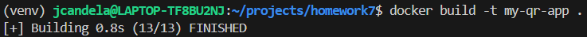
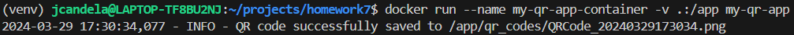
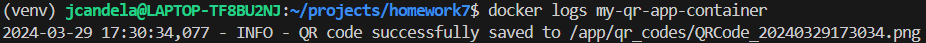

# Homework 7

## Scan QR code below to be redirected to my GitHub homepage

## Building the docker image

## Running the docker container with the image

## Viewing the logs of the docker container

